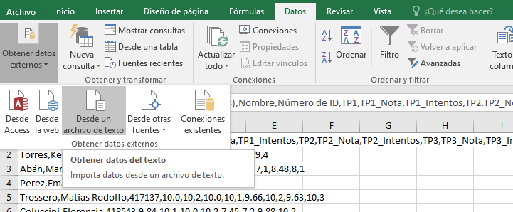
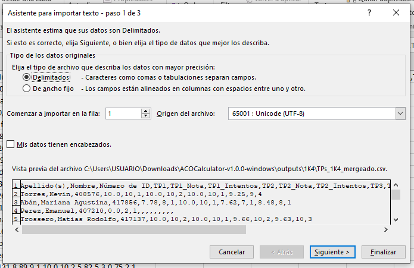
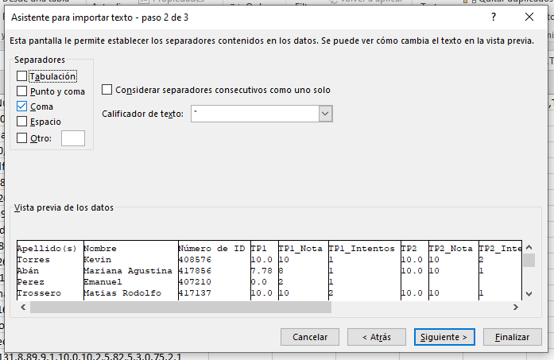

# Como abrir archivos CSV en Excel

1. Abrir Excel
2. Hacer click en la pestaña de "Datos", luego "Obtener datos externos", "Desde un archivo de texto" y luego seleccionar el archivo CSV deseado

3. Seleccionar como tipo de archivo "Delimitados"

4. Seleccionar como separador "Coma"

5. Presionar "Finalizar"
